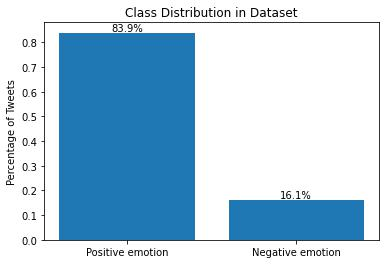

# Sentiment Analysis for Apple Marketing's SXSW Review

## Business Understanding

This is a review of reception of the Apple brand (approximated by Twitter) at this year's South by Southwest tech conference to help Apple's marketing team prepare the brand's strategy for next year's SXSW conference.

## Data Understanding

I used ~8000 tweets from SXSW directed towards Apple, Google and Android <a href="https://data.world/crowdflower/brands-and-product-emotions" target="_blank">sourced from Crowdflower</a>.

Ultimately, a classifier was built using only those tweets which were classified as having a sentiment of "positive emotion" or "negative emotion". As illustrated by the bar chart below, this is an imbalanced classification problem.



## Data Analysis

- Apple is mentioned far more often than Google or Android, and the ratio of positive to negative tweets towards Apple exceeds 4:1.

- The release of the iPad 2 and the iPad giveaway, as well as the pop-up store in downtown Austin, are received extremely positively and receive a lot of positive mentions, though the iPad2 is also the most frequently mentioned word in negative tweets.

## Modeling

The goal was to build a classifier for positive and negative tweets, then use the model's confidence score as a rating (i.e. a model confidence of 0.84 in the positive class would be interpreted as, this tweet is 84% positive.)

## Evaluation

The following are the results of the final model on the hold-out test set.

**Accuracy** &nbsp; 84.2%

**Balanced accuracy** &nbsp; 74.4%

**Classification Report**

| Class | Precision | Recall | F1 Score | Support |
| --- | --- | --- | --- | --- |
| Negative Tweets | 0.49 | 0.6 | 0.54 | 108 |
| Positive Tweets | 0.93 | 0.89 | 0.9 | 602 |


Due to the class imbalance (illustrated earlier under "Data Understanding"), the accuracy of the final model is entirely unimpressive, and the model is unsuitable for use.

The best insights came from the exploratory data analysis performed in preparation for modeling. These yielded the recommendations below (based on what seemed to cause Apple to receive so much positive attention on Twitter at this year's SXSW conference.)

## Recommendations

<u>Summary</u>

- Host another pop up store downtown.
- Time the release of a new product (if possible.)

Based on exploratory data analysis performed prior to the modeling stage, I recommend that Apple's marketing team considers another pop-up store at next year's SXSW and timing the release of a new product with the conference again, if possible, as part of their conference strategy.
 
The pop-up store downtown and the iPad 2 launch / giveaway garnered an overwhelmingly positive and relatively large amount of attention on Twitter at this year's conference, and they made Apple the focal point of SXSW (at least, on Twitter.)

## Next Steps

Try building two classifiers -- one to optimize negative class precision and the other to optimize positive class precision. These models may be better suited to rate the most negative and positive tweets, respectively.

## More Information

For more information, take a look at the [presentation slides](presentation.pdf) and / or [Jupyter notebook](analysis_and_binary_classifier.ipynb).

## Repository Structure

```
├── Archives
├── images
├── .gitignore
├── README.md
├── analysis_and_binary_classifier.ipynb
└── presentation.pdf
```
